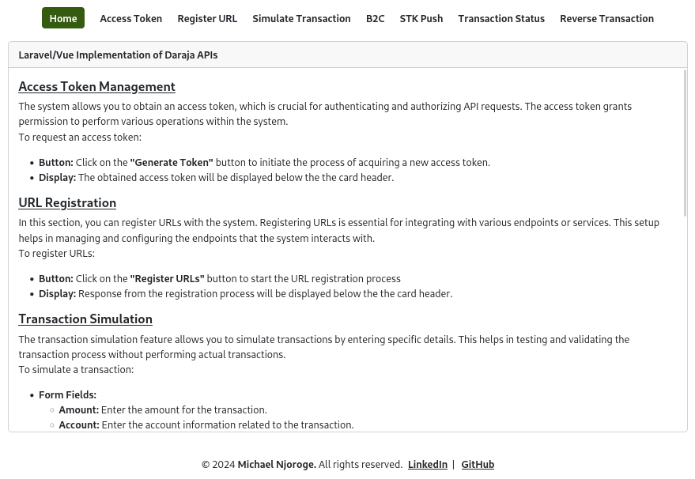
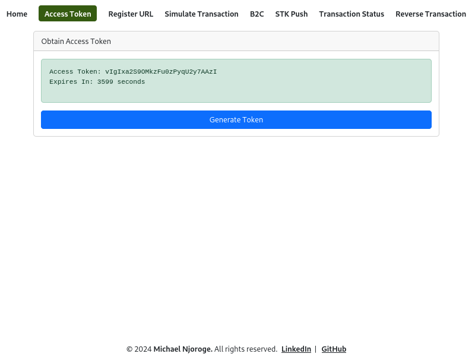
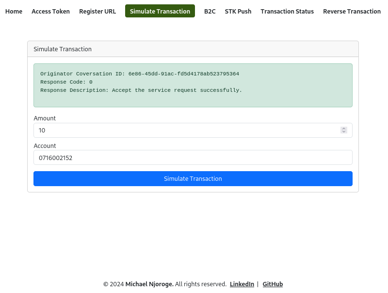
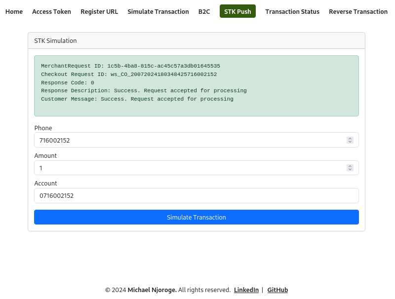

# Mpesa STK Frontend
This is a Vue frontend for interacting with Mpesa APIs. To use this application, you need to have both the frontend and the backend set up. The backend should handle the Mpesa API requests, while the frontend provides an interface for simulating transactions and other operations.
Backend API URL: ```https://github.com/Michael-Njoroge/MPESA-STK-Laravel```

## Setup

To set up the environment variables, create a `.env` file in the root of your project and add the following variables:
```env
MPESA_CONSUMER_KEY=YourConsumerKeyHere
MPESA_CONSUMER_SECRET=YourConsumerSecretHere
MPESA_SHORTCODE=YourShortcodeHere
MPESA_STK_SHORTCODE=YourSTKShortcodeHere
MPESA_ENVIRONMENT=0
MPESA_TEST_MSISDN=YourTestMSISDNHere 
MPESA_TEST_URL=YourTestURLHere
MPESA_PASSKEY=YourPasskeyHere
MPESA_B2C_INITIATOR=YourB2CInitiatorHere
MPESA_B2C_PASSWORD=YourB2CPasswordHere
```

## Home Page

*Description: The home page of the Mpesa STK frontend, showing an overview of the available features and options.*

## Obtain Access Token

*Description: The page where users can obtain an access token by clicking the 'Generate Token' button.*

## Register URL

*Description: The interface for registering URLs for Mpesa transactions, including validation and submission fields.*

## Simulate Transaction

*Description: The simulation page for conducting test transactions, with input fields for amount, phone number, and account details.*

## B2C Simulation

*Description: The B2C (Business to Customer) simulation page, allowing users to simulate business-to-customer transactions.*

## STK Simulation

*Description: The STK (Sim Tool Kit) simulation page, where users can simulate STK push requests and receive prompts on their phones.*

## Transaction Status

*Description: The transaction status page, displaying the status of recent transactions including success and failure messages.*

## Reverse Transaction

*Description: The interface for reversing transactions, allowing users to input transaction details and initiate reversals.*

## STK Push Callback

Here is a sample response for an STK Push Callback:

```json
{
  "request": {
    "Body": {
      "stkCallback": {
        "MerchantRequestID": "6e86-45dd-91ac-fd5d4178ab523795267",
        "CheckoutRequestID": "ws_CO_20072024174758900716002152",
        "ResultCode": 0,
        "ResultDesc": "The service request is processed successfully.",
        "CallbackMetadata": {
          "Item": [
            {
              "Name": "Amount",
              "Value": 1.0
            },
            {
              "Name": "MpesaReceiptNumber",
              "Value": "SGK7AVIU6H"
            },
            {
              "Name": "Balance"
            },
            {
              "Name": "TransactionDate",
              "Value": 20240720174810
            },
            {
              "Name": "PhoneNumber",
              "Value": 254716002152
            }
          ]
        }
      }
    }
  }
}
```

